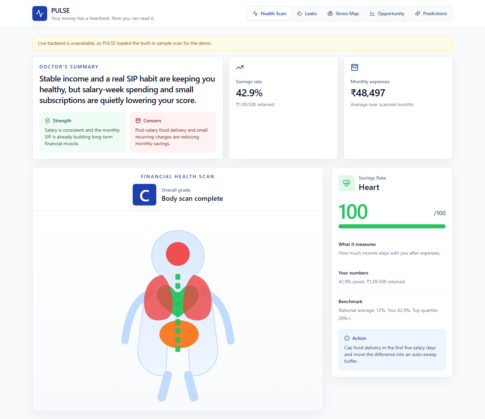
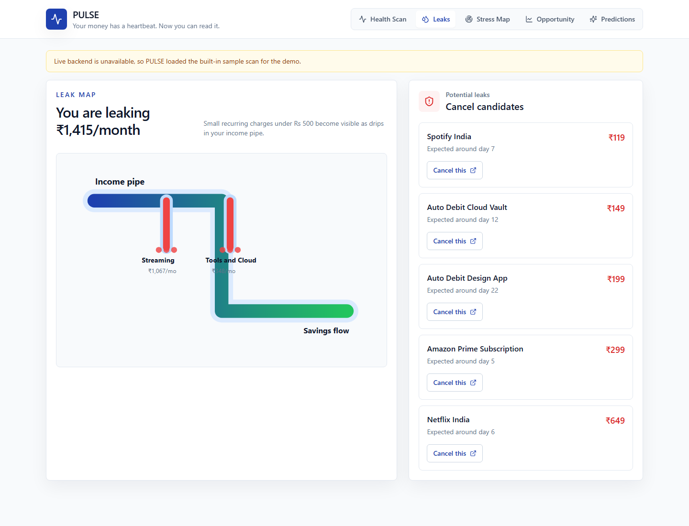
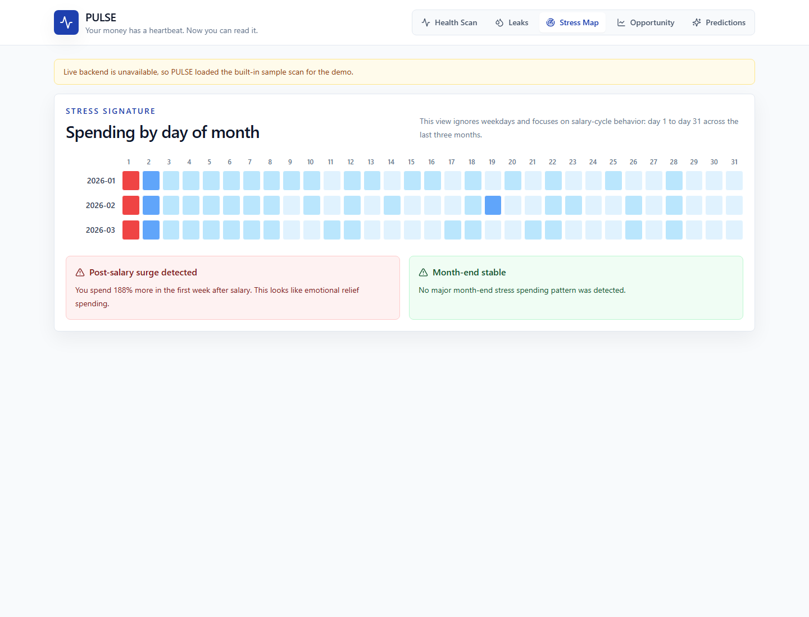
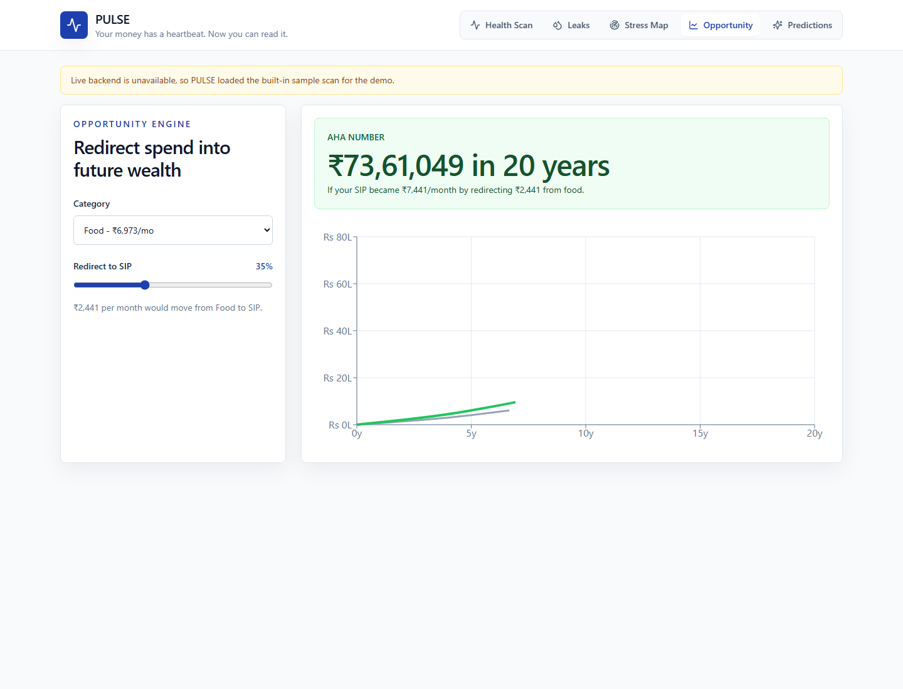
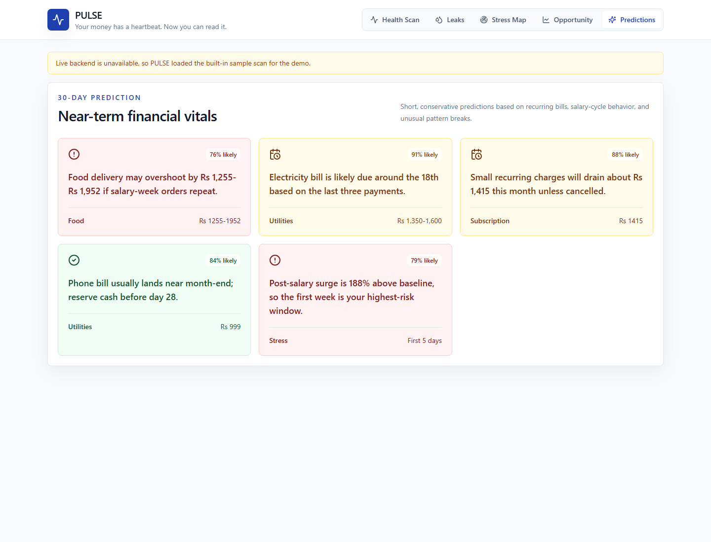

# PULSE - Financial Health Intelligence

PULSE treats your bank statement like a radiologist treats an X-ray: it scans every transaction, maps financial vital signs to a human body, and turns a confusing monthly CSV into a clear Financial Health Scan.

> Your money has a heartbeat. Now you can read it.

## Why This Matters

80% of Indians have no access to financial advice. PULSE democratizes financial health diagnosis for everyone by making the bank statement, a document every customer already receives, readable and actionable.

## Tech Stack

| Layer | Stack |
| --- | --- |
| Frontend | React, Vite, Tailwind CSS |
| Backend | FastAPI, Python |
| AI | Google Gemini 2.0 Flash via `google-generativeai` |
| Charts | Recharts, D3 |
| Deployment | Backend Dockerfile, frontend Vercel config |

## Core Features

- Body Scan: SVG human body visualization where organs represent savings, liquidity, discipline, income stability, and investing.
- Upload Flow: CSV/PDF upload, privacy-first message, sample statement, and CT-style scanning animation.
- Demo Dataset: Priya Sharma, a Bangalore software engineer with disciplined SIP behavior, salary-week spending stress, and subscription leaks.
- Leak Map: Animated pipe and drip visualization for forgotten recurring charges.
- Stress Signature: Day-of-month spending heatmap that reveals salary-cycle patterns.
- Opportunity Engine: SIP redirection calculator with 5, 10, and 20 year wealth projections.
- Prediction Panel: Conservative 30-day predictions for overspend risks and upcoming bills.

## Live Demo

Frontend: https://pulse-lake-alpha.vercel.app

Backend: https://pulse-backend-l89i.onrender.com

The live frontend includes a resilient sample mode so judges can complete the demo even if the backend service is sleeping or not yet connected.

## Privacy Promise

Your data is analyzed and immediately discarded. Nothing is stored on any server. PULSE is stateless and uses no database.

## Setup

### Backend

```bash
cd backend
python -m venv .venv
.venv\Scripts\activate
pip install -r requirements.txt
set GEMINI_API_KEY=your_key_here
uvicorn main:app --reload --port 8000
```

If `GEMINI_API_KEY` is not set, the app still runs with deterministic fallback analysis for the demo dataset and CSV uploads.

### Frontend

```bash
cd frontend
npm install
npm run dev
```

Open `http://localhost:5173`.

### Docker Compose

```bash
docker compose up --build
```

Frontend: `http://localhost:5173`  
Backend health check: `http://localhost:8000/api/health`

## Environment Variables

| Variable | Required | Description |
| --- | --- | --- |
| `GEMINI_API_KEY` | Optional for demo, required for live AI parsing | Google Gemini API key |
| `VITE_API_BASE` | Optional | Frontend API base URL, defaults to `http://localhost:8000` |

## Screenshot Placeholders


### Body Scan Overview




### Leak Map



### Stress Signature



### Opportunity Engine



### Prediction Panel



## API

- `GET /api/health`
- `POST /api/analyze` with multipart fields:
  - `file`: optional CSV or PDF
  - `sample_mode`: `true` or `false`
- `POST /api/predict` with summary JSON
